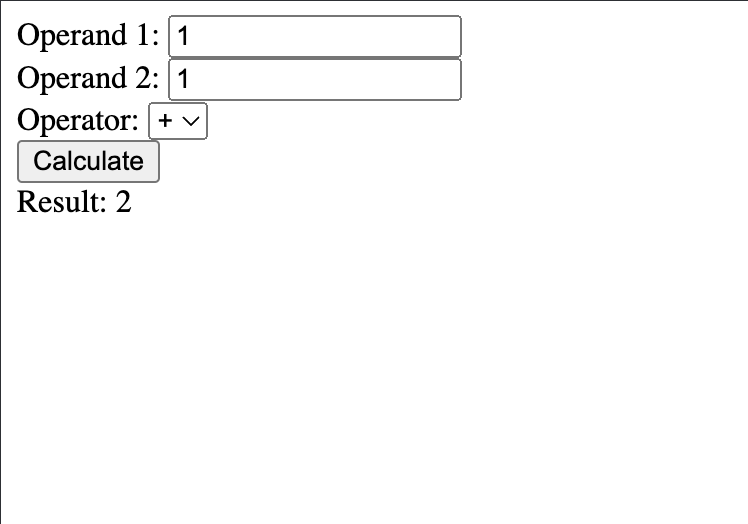

<!-- .slide: id="lesson12" -->

# Basic Frontend - Fall 2023

Lesson 12, Tuesday, 2022-11-07

---

### Recap: HTML and Javascript

Basic button with click handler:

```html
<button onclick="handleButtonClick()">Click me!</button>
```

In javascript:

```js
function handleButtonClick() {
  console.log("The button was clicked!");
}
```

---

### Recap: DOM object

`document.body` is an object, we can change the (CSS) style properties of it:

```js
// change the page background color:
document.body.style.backgroundColor = "red";

// Make our click handler change the background color!
function handleButtonClick() {
  console.log("The button was clicked!");
  document.body.style.backgroundColor = "green";
}
```

---

### Recap: Find HTML elements using Javascript

By giving an element an `id` attribute:

```html
<div id="myDiv">Hello!</div>
```

We can access it in javascript:

```js
let someDiv = document.getElementById("myDiv");
someDiv.textContent = "Goodbye!";
someDiv.style.backgroundColor = "blue";
```

---

### More practice with DOM and functions

---

### Task 1

In HTML, create a div, an input, and a button.

When the user puts their name into the input and clicks the button, set the div content to:

```"Hello {Name}!"```

---

### Task 2

In HTML, create an input, and a button.

When the user types a color into the input and clicks the button, set the body background color to what the user input.

So if the user types "blue" into the input and clicks the button, the page background color should turn blue. 

---

### Task 3

You are tasked with creating a basic calculator application that can perform addition and subtraction.

Provide two input fields for operands (Operand 1 and Operand 2), a dropdown menu for the operator (+ and -), a "Calculate" button, and a div element for displaying the result.

When the user clicks the "Calculate" button, retrieve the values from the input fields and the selected operator from the dropdown menu.

---

### Task 3 (CONTD)

Using JavaScript, perform the appropriate operation (addition or subtraction) based on the selected operator.

Display the result in the designated div.

 <!-- .element height="300px" width="500px" --> 

